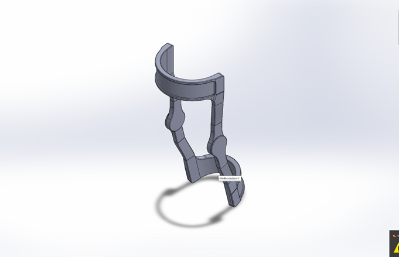

# Modular Knee Brace (MK-Brace)

## Overview
The Modular Knee Brace (MK-Brace) is a lightweight, 3D-printed, parametric rehabilitation device designed to provide joint support, improve comfort, and enable biomechanical data collection.

This project focuses on developing a modular orthopedic system that bridges mechanical design, embedded systems, and rehabilitation engineering.

The current version is a **passive modular brace with planned sensor integration** for motion tracking, load monitoring, and usage analysis.

---

## Objectives

- Reduce bulk and weight compared to traditional braces
- Improve comfort and wearability
- Enable modular customization and repair
- Support a range of leg sizes through parametric CAD
- Provide a platform for biomechanical sensing and data collection
- Maintain low-cost, accessible manufacturing via 3D printing

---

## Key Features

### Mechanical Design
- Modular architecture with interchangeable components
- Mirrored hinge system for bilateral use
- Snap-fit connections with optional secondary fastening
- Parametric sizing for user-specific adjustments
- Designed for rapid prototyping via STL-based workflows

### Materials
- Primary: PLA / PETG (prototype), Nylon (future iterations)
- Structural upgrades: Carbon-fiber-reinforced materials (planned)
- Comfort interface: TPU / soft padding + Velcro straps

### Manufacturing
- Designed in SolidWorks
- Exported as STL files
- Fabricated via FDM 3D printing
- Post-processing includes support removal and adhesive reinforcement

---

## System Architecture (Planned)

### Mechanical Subsystem
- Hinges (primary load-bearing)
- Connectors (modular joints)
- Upper and lower supports
- Adjustable fastening system

### Embedded System (Future Integration)
- Microcontroller: ESP32
- Sensors:
  - Magnetic rotary encoder (knee angle)
  - Dual IMUs (thigh + shin)
  - Pressure sensors (fit and load monitoring)
- Power: LiPo battery
- Communication: BLE / USB

---

## Use Case

The MK-Brace is designed for:
- Post-injury rehabilitation
- Mild-to-moderate knee instability
- Gait monitoring and movement tracking
- Long-duration wearable support

---

## Development Roadmap

### Phase 1 — Mechanical Prototype
- Finalize CAD geometry
- Print and assemble prototype
- Validate fit, comfort, and structural integrity

### Phase 2 — Instrumentation
- Integrate sensors into brace structure
- Develop mounting and enclosure solutions

### Phase 3 — Firmware
- Sensor acquisition and filtering
- Angle estimation and motion tracking
- Data logging and communication

### Phase 4 — Data & Analysis
- ROM tracking
- Usage analytics
- Gait pattern insights

### Phase 5 — Iteration & Optimization
- Material upgrades
- Custom PCB development
- Improved ergonomics and manufacturability

---

## Current Status
- Mechanical design: In progress
- Prototype fabrication: Active
- Embedded system: Planned
- Software stack: Not yet implemented

---

## Repository Structure

| Path | Contents |
| --- | --- |
| `docs/` | Course write-up: `EGN-3433C-Design-Project-Final.docx`; README hero image: `images/mk-brace-cad-render.png` |
| `cad/` | Top-level release assembly: `finalkneeassem4.SLDASM` |
| `modular-knee-brace-package/` | Complete design hand-off: instruction PDF, SolidWorks assemblies and parts, STL print files, and simulation artifacts (`files/`, including `.CWR` and related solver files) |
| `resources/` | Pointers to external learning repos, [GrabCAD](https://grabcad.com/), and [SolidWorks Python tooling](https://github.com/Glutenberg/swtoolkit) (see `resources/README.md`) |

Large CAD, meshes, and simulation results are stored with **Git LFS**; clone with [Git LFS](https://git-lfs.com/) installed so pointers resolve to real files.
